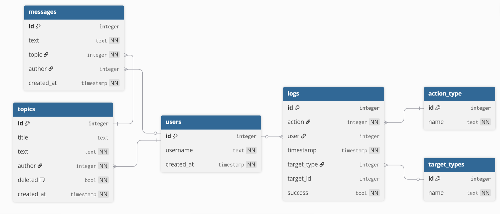

## Решение тестового задания Farpost
Направление: Data-engineering\
Автор: Янович Яков

---

### О решении
Для хранения логов форума разработана следующая схема базы данных:

__Подготовка к запуску__

1. Установить зависимости\
`pip install -r requirements.txt`
2. Запустить контейнер базы данных\
`docker compose up`

__Запуск__

Скрипты оформлены в виде консольного приложения

Генерация данных\
`python -m logs_app generate`\
Опциональные аргументы:
- --start-date (по умолчанию 2026-01-01) - Дата начала (YYYY-MM-DD)\
- --days (по умолчанию 30) - Количество дней для генерации\
- --users (по умолчанию 100) - Количество создаваемых пользователей

Загрузка данных в базу\
`python -m logs_app load`
Опциональные аргументы:
-  --truncate-tables - Очистить таблицы перед загрузкой данных

Выборка из базы данных\
`python -m logs_app select --from-date 2026-01-01 --to-date 2026-01-30`
Обязательные аргументы:
- --from-date
- --to-date\
Опциональные аргументы:
- --output (по умолчанию report.csv) - Выходной файл CSV для отчета